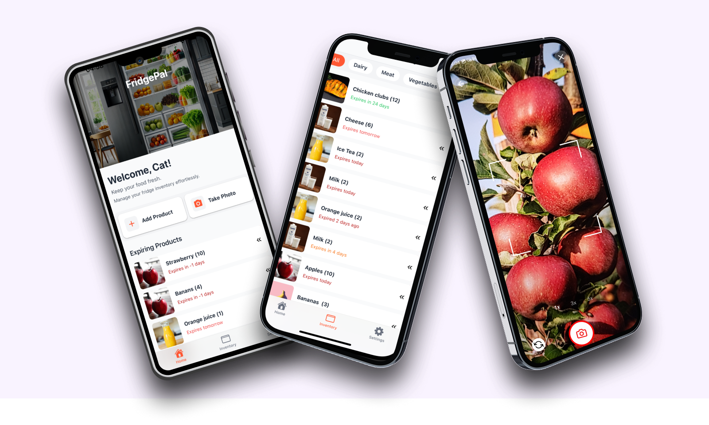

# FridgePal

**🏆 Clean Code Hackathon 2025 - First Place Winner 🏆**

<div align="left">
  
</div>

Your smart kitchen companion that helps you reduce food waste and save money! FridgePal uses your phone's camera to scan and identify food products, automatically tracking their expiration dates so you never have to guess what's fresh in your fridge.

## Key Features

- **Smart Scanning**: Use your phone's camera to instantly identify food items
- **AI-Assisted Entry**: Take a photo and let FridgePal auto-fill product info for you
- **User Authentication**: Secure login and registration with personal data isolation
- **Expiry Tracking**: Automatic expiration date detection and reminders
- **Inventory Management**: Keep a real-time overview of everything in your fridge
- **Image Storage**: Upload and store product photos securely
- **Smart Notifications**: Get alerts 3 days before items expire

Say goodbye to forgotten leftovers and expired groceries. With FridgePal, you'll always know what you have, when it expires, and how to use it before it goes bad!

## Tech Stack

- **React Native** – Mobile app framework
- **Expo** – Development platform and tools
- **Expo Router** – File-based navigation
- **Expo Notifications** – Push notification system
- **Expo Task Manager** – Background notification processing
- **NativeWind** – Tailwind CSS for React Native
- **TypeScript** – Type safety
- **Supabase** – Backend database, auth & storage
- **Supabase Auth** – User authentication and session management
- **OpenAI Vision API** – AI-powered food recognition
- **PostgreSQL** – Database (via Supabase)

## Architecture

This is a full-stack mobile application featuring:
- **Frontend**: React Native with Expo for cross-platform mobile development
- **Backend**: Supabase for database, authentication, and file storage
- **Notifications**: Smart notification system with background scheduling
- **AI Integration**: OpenAI Vision API for intelligent food recognition
- **Security**: User authentication with data isolation and session persistence

## Environment Variables

Create a `.env` file in the project root with:

```bash
EXPO_PUBLIC_SUPABASE_URL=your_supabase_project_url
EXPO_PUBLIC_SUPABASE_ANON_KEY=your_supabase_anon_key
EXPO_PUBLIC_OPENAI_API_KEY=your_openai_api_key
```

## Database Schema

The app uses PostgreSQL via Supabase with user authentication and data isolation:
- **products** - Food items with expiration tracking (user-specific)
- **categories** - Food categories (fruits, vegetables, etc.)
- **Storage bucket** - Product images with secure access

## CI/CD Pipeline

This project uses **GitHub Actions** for Continuous Integration to ensure code quality and catch issues early.

### What Gets Checked Automatically:

Every time you push code or create a pull request, our CI pipeline automatically runs:

- ✅ **Code Quality** - ESLint checks for style and best practices
- ✅ **Type Safety** - TypeScript verification to catch type errors
- ✅ **Security** - npm audit to find vulnerable dependencies

### Workflow Triggers:

- **Push to `main`** - Full CI pipeline runs
- **Pull Requests to `main`** - All checks must pass before merging

## Prerequisites

Before you begin, ensure you have the following installed:

- **Node.js** (version 18 or higher) - [Download here](https://nodejs.org/)
- **npm** or **yarn** package manager
- **Expo CLI** (will be installed automatically)

## Quick Start

### 1. Clone and Install

```bash
git clone https://github.com/CatAvadani/FridgePal.git
cd FridgePal
npm install
```

### 2. Set Up Environment Variables

1. Create a Supabase project at [supabase.com](https://supabase.com)
2. Get an OpenAI API key at [platform.openai.com](https://platform.openai.com)
3. Create a `.env` file and add your credentials

### 3. Set Up Database

Run the SQL schema in your Supabase SQL editor for products and categories

### 4. Start the Development Server

```bash
npx expo start
```

After running this command, you'll see a QR code and several options to run the app.

## Running on Devices

### Option 1: Expo Go (Easiest for Testing)

1. **Install Expo Go** on your phone:
   - [iOS App Store](https://apps.apple.com/app/expo-go/id982107779)
   - [Google Play Store](https://play.google.com/store/apps/details?id=host.exp.exponent)

2. **Scan the QR code** displayed in your terminal with:
   - **iOS**: Camera app or Expo Go app
   - **Android**: Expo Go app

### Option 2: iOS Simulator (macOS only)

```bash
npx expo start
# Press 'i' in the terminal to open iOS simulator
```

### Option 3: Development Build (For Full Notification Support on Android)

For the complete notification experience on Android:

```bash
# Install EAS CLI
npm install -g @expo/eas-cli

# Build development version
eas build --profile development --platform android

# Install the APK on your Android device
```

## Features in Detail

### AI Food Recognition
- Take a photo of food items
- Automatic product name detection
- Smart quantity estimation
- Realistic expiration date calculation based on food type

### Inventory Management
- Add products manually or via AI
- Edit product details
- Delete expired items
- Visual expiry tracking
- User-specific data isolation

### Notification System
- Push notifications 3 days before food items expire
- Customizable notification timing and preferences in Settings
- Cross-platform support (iOS & Android) 
- User-controlled enable/disable toggle
- Background notification scheduling and management
- Automatic rescheduling when products are updated
  
### Data Storage
- Real-time synchronization
- Secure image storage
- User authentication and session management
- Data persistence across sessions

## Development Commands

```bash
# Start development server for Expo Go
npm start

# Start development server for development builds  
npx expo start --dev-client

# Start with cache cleared
npx expo start --clear

# Run on specific platforms
npx expo start --ios        # iOS only
npx expo start --android    # Android only

# Check code quality
npm run lint

# Check TypeScript
npx tsc --noEmit

# Security audit
npm audit
```

## Development Notes

### Notifications
- **iOS**: Full notification support in Expo Go and development builds
- **Android**: Requires development build for notifications (Expo Go limitation in SDK 53+)
- **Development build**: `eas build --profile development --platform android`
- **Testing**: Use `npx expo start --dev-client` for development builds, `npx expo start` for Expo Go

## Acknowledgments

- 🥇 **Originally conceived during Clean Code Hackathon 2025 – First Place Winner!** 🥇
- Thanks to [Mohanad Al-Daghestani](https://github.com/mohald-3) for the initial collaboration and architectural foundation
- **Evolved into full-stack solo project** with independent Supabase backend, OpenAI integration, and production-ready architecture
- Built with modern React Native and Supabase technologies

## Author

**Catalina Avadani** - [GitHub](https://github.com/CatAvadani) | [LinkedIn](https://www.linkedin.com/in/catalinaava09/)
